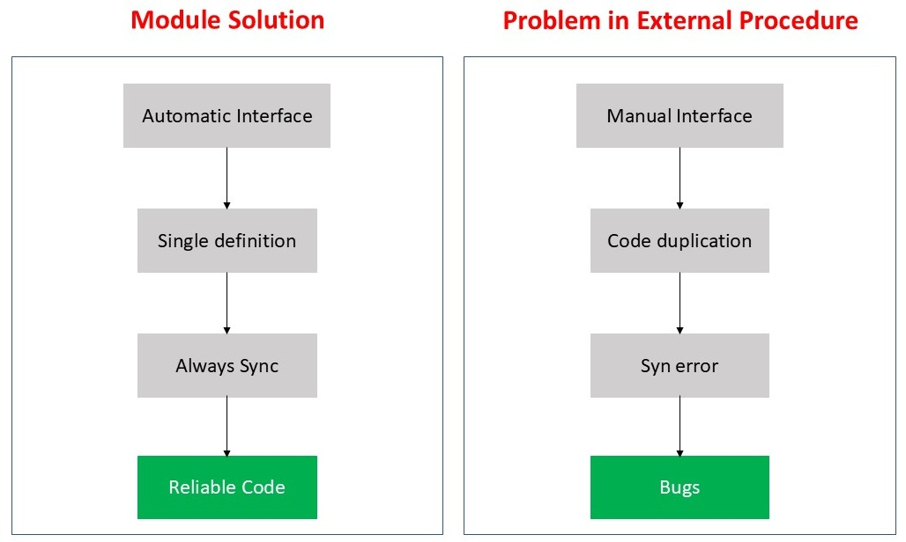
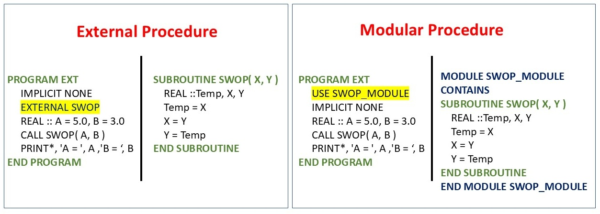

<!---  <style>H1{color:Blue;}</style> --->
<!---  <style>H2{color:DarkOrange;}</style> --->
<!---  <style>p{color:Black;}</style> --->

# **Modular Procedure Programming Paradigm**

The repository introduces the concept of

* Modular Procedures
* Fortran Package Manager

 for the Fortran phase-field codes. 

This repository advances beyond the external procedures approach by introducing two fundamental improvements that transform how phase field simulations should be developed, maintained, and executed.

## **Feature 1: Modules Instead of External Subprograms and Interface Blocks**


The Problem with External Procedures is summarized below in the table

| Aspect	| External Procedures | Modules|
|---------- |----------|----------|
| Interface blocks | Required (explicit)    | Automatic (implicitly explicit) |
| EXTERNAL statement | needed for subroutine | Not needed |
| Code duplication | High          | Not needed |
| Maintenance | High               | Very low |
| Type safety | Compiler-dependent | Guaranteed |

**The basic idea** of the modular procedures is to improve the aspects of the external procedures.



**The Solution** to the external procedures is the **Modular Architecture**
where INTERFACE blocks and EXTERNAL statements disappear entirely:

 


| Feature	| Traditional Repository | This repository|
|---------- |----------|----------|
| Code organization | External procedure + Interface blocks    | modules |
| Interface handling | Manual interface blocks | automatic |
| Build system       | Batch files          | fpm (cross-platform) |
| maintenance | High               |  low |
| code duplication | High | none |


## **Feature 2: fpm (Fortran Package Manager) as Build Tool**

 

**The Problem with Manual Building**

The previous [repository](https://github.com/Shahid718/Fortran-Phase-Field-Codes-Using-External-Procedures) used Windows batch files for compilation:

>gfortran main.f90 fluctuation.f90 chemical_potential.f90 laplace.f90 post_processing.f90 -o main

>main

Problems with this approach:

❌ No dependency tracking

❌ Must recompile everything for any change

❌ No support for different build configurations

❌ No automatic testing

❌ Difficult to manage external dependencies

❌ Platform-specific (Windows only)

**The Solution: [fpm](https://fpm.fortran-lang.org/)**

With fpm, building becomes a single command:

```
fpm build          # Build the project
fpm run            # Build and run
fpm test           # Run tests
fpm run --profile release  # Optimized build
```

# **fpm project structure**

The fpm project struture for our phase field codes (e.g. model A) looks like
```
model_A/
├── fpm.toml                # Project manifest
├── app/
│   └── main.f90            # Main program
├── src/
│   ├── chemical_potential.f90
│   ├── fluctuation.f90
│   ├── laplace.f90
|   └── post_processing.f90
├── test/
|   └── check.f90
├── parameters.txt                   ← Created at runtime
└── phi_1500.dat                     ← Created at runtime
```

### **Comparison test**

To understand the difference between the two approaches i.e. external procedures with windows batch file and procedural program with fpm, run both codes with fpm. You probably catch a **bug**!

## **Migration from External Procedures**

1. Replace INTERFACE blocks with MODULE containing the procedures

2. Remove EXTERNAL statements - not needed with modules

3. Add USE statements instead of interface blocks

4. Create fpm.toml manifest

5. Move files to src directories

6. Build with fpm build instead of batch files

### **Contact**

In case, you find issues to report or having trouble using the codes, you may contact via email

shahid@njust.edu.cn

---

**Date : 08 June 2026**
